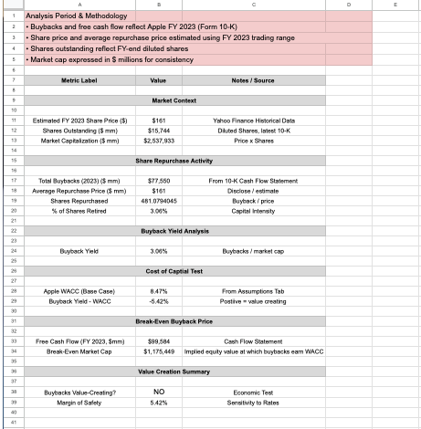
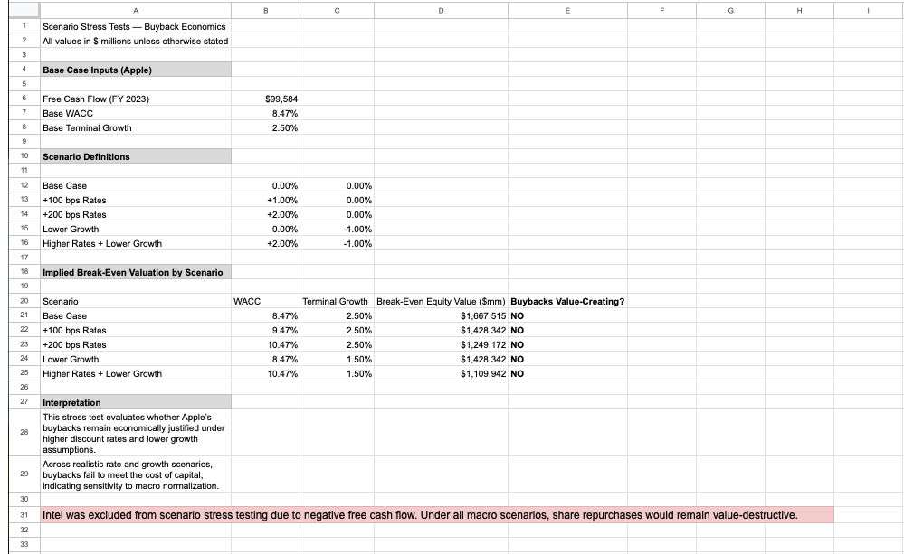
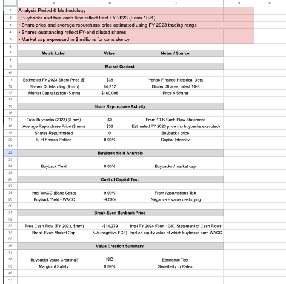
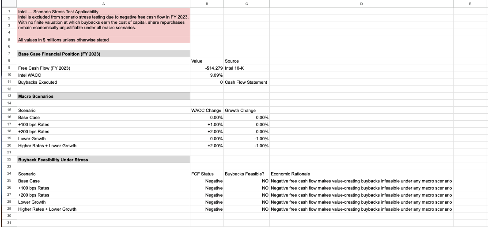

# Buybacks in a Higher-Rate World  
**Capital Allocation Stress Test: Apple vs. Intel**

**View-Only Model (Google Sheets):**  
https://docs.google.com/spreadsheets/d/1wpA_JO31PK0mlN-kghso2S5RIeTmU9Z_QyFaFlxHB9w/edit?usp=sharing

---

## Business Question
At what point do share repurchases stop creating value and begin destroying it when the cost of capital rises — and how should management respond when capital is no longer cheap?

This project evaluates whether continued buybacks remain economically rational in a structurally higher-rate environment, using Apple and Intel as contrasting case studies.

---

## Why This Matters
For more than a decade, share repurchases were an efficient and largely unquestioned use of excess corporate cash. Near-zero interest rates and low equity discount rates allowed companies to retire shares at costs well below their true returns on capital.

That environment has changed.

Despite a materially higher cost of capital, many firms continue aggressive buyback programs justified primarily by near-term EPS accretion rather than long-term value creation. This raises a critical capital allocation question: **should buybacks remain the default use of capital when they no longer clear the cost of capital?**

This analysis mirrors how FP&A, treasury, and strategy teams evaluate capital allocation decisions under shifting macroeconomic conditions.

---

## Analytical Framework
The analysis applies a valuation-driven capital allocation framework focused on economic value creation rather than accounting optics:

- Compare buyback yield to weighted average cost of capital (WACC)  
- Estimate break-even equity valuations using a free cash flow perpetuity framework  
- Stress test buyback economics under higher discount rates and lower growth assumptions  
- Evaluate alternative uses of capital when buybacks fail to earn the cost of capital  

The objective is to determine **when buybacks are value-neutral, value-creating, or value-destructive**.

---

## Key Assumptions
- Cost of capital remains structurally higher than the prior decade  
- Buybacks must earn at least WACC to create shareholder value  
- Free cash flow sustainability matters more than short-term EPS accretion  
- Capital allocation decisions are evaluated on long-term economic returns  

Assumptions are intentionally conservative to reflect realistic post-zero-rate conditions.

---

## Key Findings

### Apple
- Buyback yield falls below WACC under base-case assumptions  
- Implied break-even equity valuation is materially below current market pricing  
- Under stress scenarios (higher discount rates and/or lower terminal growth), buybacks fail to earn the cost of capital  

While Apple’s buybacks remain EPS-accretive, they are economically fragile and increasingly sensitive to macro normalization.

### Intel
- Free cash flow was negative in FY 2023  
- No valuation exists at which buybacks could earn the cost of capital  
- Buybacks were appropriately paused, reflecting capital preservation priorities  

Intel’s constraints are structural rather than valuation-driven.

---

## Decision Implications
- Buybacks should no longer be treated as a default use of excess cash  
- Valuation discipline matters more than financial engineering in a higher-rate world  
- For Apple, alternative uses of capital (reinvestment, selective M&A, or a strategic pause) offer superior long-term value  
- For Intel, capital preservation and strategic reinvestment remain economically rational despite short-term shareholder pressure  

This project demonstrates how capital allocation decisions can destroy value even at high-quality companies when macro conditions shift.

---

## Repository Contents (At a Glance)
- `assets/` — Executive screenshots illustrating buyback economics, valuation breakpoints, and stress scenarios  
- `memo/` — Executive memo summarizing the analysis and conclusions  

The primary analytical model is maintained in Google Sheets and linked above.

---

## Appendix: Model Screenshots (Executive Review Views)

*Screenshots reflect executive-level outputs used to evaluate capital allocation decisions under a higher-rate environment.*

### Apple — Buyback Metrics (Buyback Yield vs WACC)

### Apple — Scenario Stress Test (Rates & Growth Sensitivity)

### Intel — Buyback Metrics (FCF Constraint & Cost of Capital)

### Intel — Scenario Stress Test (Capital Preservation Case)

